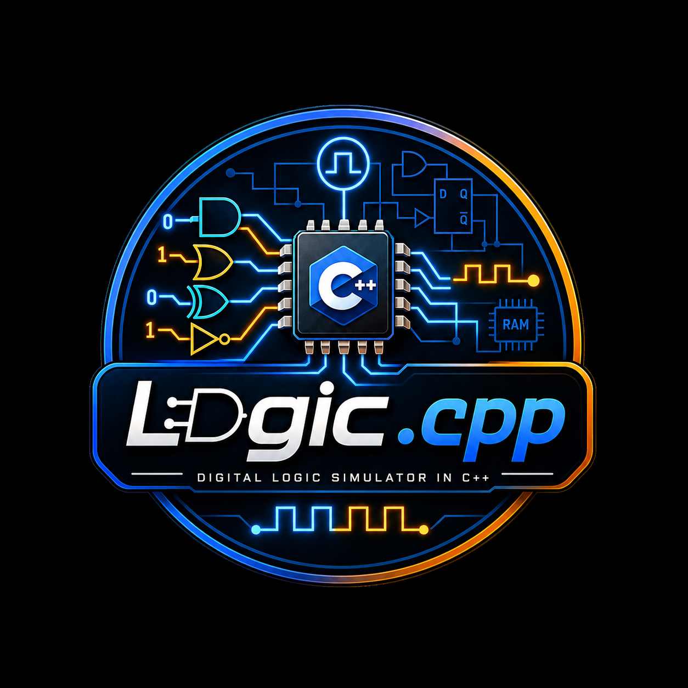

# Logic.cpp



`Logic.cpp` is a modern C++20 hardware simulation library designed for modeling, prototyping, and simulating digital logic circuits from fundamental electrical primitives to complex computer architecture components.

It models wires, buses, gates, combinational datapaths, sequential storage, memory structures, tri-state bus drivers, and simulation infrastructure—allowing higher-level computer architecture projects (such as `CPU.cpp`) to be built cleanly from modular hardware building blocks.

---

## Key Hardware Subsystems & Components

```
logic/
├── signals/        # Wires, Buses, Clocks, LogicState, TriStateBuffer, BusDriver
├── gates/          # Primitive logic gates (AND, OR, NOT, NAND, NOR, XOR, XNOR, BUFFER)
├── combinational/  # Memoryless digital circuits
│   ├── adders/       # HalfAdder, FullAdder, RippleCarryAdder
│   ├── subtractors/  # HalfSubtractor, FullSubtractor
│   ├── alu/          # Multi-function ALU with status flags (Z, C, V, N)
│   ├── multiplexers/ # Mux (2:1 to N:1) and Demux (1:2 to 1:N)
│   ├── decoders/     # Binary Line Decoders (2:4, 3:8)
│   ├── encoders/     # Encoder (4:2) and PriorityEncoder
│   ├── shifters/     # Logical Left/Right, Arithmetic Right, BarrelShifter
│   ├── extenders/    # ZeroExtender, SignExtender
│   ├── bit_operations/ # BitSelector, BitSlice
│   ├── comparators/  # Bit and Magnitude Comparators
│   └── bitwise/      # Bus-wide bitwise operation units
├── sequential/     # Synchronous and stateful storage components
│   ├── latches/      # SR, Gated-SR, D-Latches
│   ├── flipflops/    # D, SR, JK, T Flip-Flops
│   ├── registers/    # Parallel Registers, Shift Registers (SISO, SIPO, PISO, PIPO)
│   ├── counters/     # Ripple, Binary, Up/Down, Modulo, Ring, Johnson Counters
│   └── memory/       # RegisterFile (Dual-Read), ROM, RAM, MemoryController, Memory
└── simulator/      # Time tracking and signal propagation simulation engine
```

---

## Features

- **4-State Logic System**: Supports `LOW` (`0`), `HIGH` (`1`), `UNDEFINED` (`X`), and `HIGH_IMPEDANCE` (`Z`) for modeling tri-state buses and bus contention.
- **Hardware-Centric Composition**: Components inherit from `logic::Component` and evaluate signals via `evaluate() noexcept`.
- **Flexible Data Paths**: Templated buses (`Bus<N>`) supporting arithmetic, logical shifting, sign extension, bit slicing, and priority encoding.
- **Consumable Library**: Easily linkable into sibling CMake projects (`CPU.cpp`) as an interface/static library (`target_link_libraries(my_target PRIVATE logic)`).

---

## Build Instructions

This project uses **CMake 3.20+** and requires a C++20 compatible compiler toolchain (MSVC, GCC, Clang).

```powershell
# Configure CMake build
cmake -B build -S . -DLOGIC_BUILD_EXAMPLES=ON

# Build all targets and tests
cmake --build build
```

---

## Running Unit Tests

Run the built unit test executables (located in the `build` directory):

```powershell
# Run expanded component tests (Shifters, Extenders, Encoders, Bus Drivers, Bit Operations)
.\build\test_expanded_components.exe

# Run memory subsystem tests
.\build\test_memory.exe

# Run counter subsystem tests
.\build\test_binary_counter.exe
```

---

# NOTE: CPU.cpp is currently under development so it's not advisable to perform the instruction below

## Integration in External Projects

To consume `Logic.cpp` inside sibling projects (e.g. `CPU.cpp`):

```cmake
add_subdirectory(${CMAKE_CURRENT_SOURCE_DIR}/../Logic.cpp ${CMAKE_CURRENT_BINARY_DIR}/logic_build)

add_executable(cpu_simulator main.cpp)
target_link_libraries(cpu_simulator PRIVATE logic)
```

