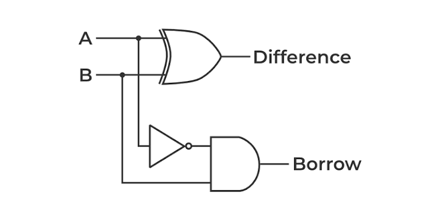
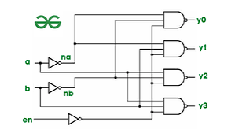

# Combinational Circuits

Higher-level digital logic blocks built from primitive logic gates in `gates/` and composite subcircuits. Every circuit in this module is header-only — simply include the header and wire the components together using the `logic::Wire` and `logic::Bus` signal primitives.

Combinational logic circuits are memoryless systems whose outputs are determined strictly by the present state of their inputs.

---

## Architectural Taxonomy & Design Philosophy

The combinational circuit library in `Logic.cpp` follows a strict two-tiered object-oriented hierarchy:

1. **Gate Primitive Level (Atomic Building Blocks)**:
   Base circuits (such as [`HalfAdder`](halfAdder.hpp), [`HalfSubtractor`](halfSubtractor.hpp), [`Mux2to1`](Mux2to1.hpp), [`Dec2to4`](Dec2to4.hpp), and `Comparator1Bit`) instantiate primitive logic gates directly (`XorGate`, `ANDGate`, `NotGate`, `OrGate`, `XnorGate`). They map direct Boolean algebraic expressions into gate objects.

2. **Hierarchical Composite Level (Subcircuit Composition)**:
   Complex digital subsystems are constructed by composing existing, verified subcircuits alongside necessary glue logic, rather than re-implementing raw logic gates from scratch:
   - **[`FullAdder`](fullAdder.hpp)** is constructed by cascading **2 [`HalfAdder`](halfAdder.hpp) subcircuits** and 1 primitive `OrGate`.
   - **[`FullSubtractor`](fullSubtractor.hpp)** is constructed by cascading **2 [`HalfSubtractor`](halfSubtractor.hpp) subcircuits** and 1 primitive `OrGate`.
   - **[`Mux4to1`](Mux4to1.hpp)** is constructed by nesting **3 [`Mux2to1`](Mux2to1.hpp) subcircuits**.
   - **[`RippleCarryAdder<N>`](RippleCarryAdder.hpp)** is constructed by cascading **$N$ [`FullAdder`](fullAdder.hpp) subcircuits** using internal carry wires.
   - **[`Comparator<N>`](Comparator.hpp)** is constructed by aggregating **$N$ `Comparator1Bit` subcircuits** connected via multi-bit `Bus<N>` signals.

---

## Component Architectural Matrix

| Header | Circuit Class | Composition Level | Component Breakdown | Sub-Components / Gates Used |
|--------|---------------|-------------------|---------------------|-----------------------------|
| [`halfAdder.hpp`](halfAdder.hpp) | `HalfAdder` | **Gate Primitive** | 2 Primitive Gates | 1 `XorGate`, 1 `ANDGate` |
| [`fullAdder.hpp`](fullAdder.hpp) | `FullAdder` | **Hierarchical Composite** | 2 Sub-Components + 1 Gate | 2 `HalfAdder`, 1 `OrGate` |
| [`halfSubtractor.hpp`](halfSubtractor.hpp) | `HalfSubtractor` | **Gate Primitive** | 3 Primitive Gates | 1 `NotGate`, 1 `XorGate`, 1 `AndGate` |
| [`fullSubtractor.hpp`](fullSubtractor.hpp) | `FullSubtractor` | **Hierarchical Composite** | 2 Sub-Components + 1 Gate | 2 `HalfSubtractor`, 1 `OrGate` |
| [`Mux2to1.hpp`](Mux2to1.hpp) | `Mux2to1` | **Gate Primitive** | 4 Primitive Gates | 1 `NotGate`, 2 `ANDGate`, 1 `OrGate` |
| [`Mux4to1.hpp`](Mux4to1.hpp) | `Mux4to1` | **Hierarchical Composite** | 3 Sub-Components | 3 `Mux2to1` |
| [`Dec2to4.hpp`](Dec2to4.hpp) | `Dec2to4` | **Gate Primitive** | 6 Primitive Gates | 2 `NotGate`, 4 `AndGate` |
| [`RippleCarryAdder.hpp`](RippleCarryAdder.hpp) | `RippleCarryAdder<N>` | **Templated Cascaded** | $N$ Sub-Components | $N$ `FullAdder` |
| [`Comparator.hpp`](Comparator.hpp) | `Comparator<N>` | **Templated Cascaded** | $N$ Sub-Components + Bus | $N$ `Comparator1Bit` (each with 2 `NotGate`, 1 `XnorGate`, 2 `ANDGate`) |

---

## Circuit Specifications & Implementation Details

### 1. Half Adder (`halfAdder.hpp`)

Adds two 1-bit binary inputs ($A$, $B$) to produce a 1-bit `Sum` and a `Carry` output.

#### Gate Primitive Breakdown
The `HalfAdder` class directly instantiates primitive logic gates as private member objects:
- **`XorGate m_sumGate(a, b, sum)`**: Computes the bitwise sum ($A \oplus B$).
- **`ANDGate m_carryGate(a, b, carry)`**: Computes the bitwise carry ($A \cdot B$).

#### Boolean Equations
$$\text{Sum} = A \oplus B$$
$$\text{Carry} = A \cdot B$$


#### Truth Table
| A | B | Sum | Carry |
|---|---|-----|-------|
| 0 | 0 |  0  |   0   |
| 0 | 1 |  1  |   0   |
| 1 | 0 |  1  |   0   |
| 1 | 1 |  0  |   1   |

#### C++ Usage Example
```cpp
logic::Wire a(logic::LogicState::HIGH), b(logic::LogicState::HIGH);
logic::Wire sum, carry;

logic::HalfAdder adder(a, b, sum, carry);
adder.evaluate(); // sum -> LOW, carry -> HIGH
```


---

### 2. Full Adder (`fullAdder.hpp`)

Adds three 1-bit binary inputs ($A$, $B$, $C_{in}$) using **two `HalfAdder` subcircuits** and **one primitive `OrGate`**.

#### Hierarchical Composition & Modular Subcircuit Breakdown
Rather than redefining raw logic gates, `FullAdder` reuses two `HalfAdder` instances connected via internal signal wires (`m_sum1`, `m_carry1`, `m_carry2`):

1. **`HalfAdder m_halfAdder1(a, b, m_sum1, m_carry1)`**:
   - Takes external inputs $A$ and $B$.
   - Produces intermediate sum $S_1$ (`m_sum1`) and intermediate carry $C_1$ (`m_carry1`).
   - Equations: $S_1 = A \oplus B$, $C_1 = A \cdot B$.

2. **`HalfAdder m_halfAdder2(m_sum1, cin, sum, m_carry2)`**:
   - Takes intermediate sum $S_1$ and external carry-in $C_{in}$.
   - Produces final output **`Sum`** and intermediate carry $C_2$ (`m_carry2`).
   - Equations: $\text{Sum} = S_1 \oplus C_{in} = (A \oplus B) \oplus C_{in}$, $C_2 = S_1 \cdot C_{in} = (A \oplus B) \cdot C_{in}$.

3. **`OrGate m_carryGate(m_carry1, m_carry2, carry)`**:
   - ORs intermediate carries $C_1$ and $C_2$ to generate the final output **`Carry`**.
   - Equation: $\text{Carry} = C_1 \lor C_2 = (A \cdot B) \lor ((A \oplus B) \cdot C_{in})$.

#### Why OR Gate is Used for Carries (Mutual Exclusivity Proof)
The two intermediate carry signals $C_1$ and $C_2$ can **never** be HIGH simultaneously:
$$C_1 = 1 \implies A = 1 \text{ and } B = 1$$
$$\text{If } A = 1 \text{ and } B = 1 \implies S_1 = A \oplus B = 0$$
$$C_2 = S_1 \cdot C_{in} = 0 \cdot C_{in} = 0$$
Since $C_1 \cdot C_2 = 0$ for all input combinations, an `OrGate` yields identical behavior to an `XorGate` with lower propagation complexity.


#### Structural Schema
```
                      +-------------------+
A ------------------->|                   |-- S1 --+
                      |    HalfAdder 1    |        |    +-------------------+
B ------------------->|  (m_halfAdder1)   |-- C1 --+--->|                   |-- Sum
                      +-------------------+        |    |    HalfAdder 2    |
Cin -----------------------------------------------+--->|  (m_halfAdder2)   |-- C2 --+
                                                        +-------------------+        |   +---------------+
                                                                                     +-->|    OrGate     |-- Carry
                                                                                         | (m_carryGate) |
                                                                                         +---------------+
```

#### Evaluation Pipeline in C++
```cpp
void evaluate()
{
    m_halfAdder1.evaluate(); // Step 1: Compute S1 and C1
    m_halfAdder2.evaluate(); // Step 2: Compute Sum and C2
    m_carryGate.evaluate();  // Step 3: Compute final Carry = C1 | C2
}
```

---

### 3. Half Subtractor (`halfSubtractor.hpp`)

Subtracts bit $B$ from bit $A$, yielding a `Difference` output and a `Borrow` output.

#### Gate Primitive Breakdown
The `HalfSubtractor` class directly instantiates three primitive logic gates:
- **`NotGate not_gate(a, not_a_)`**: Inverts input $A$ to produce internal signal $\bar{A}$ (`not_a_`).
- **`XorGate difference_gate(a, b, difference)`**: Computes the bitwise difference ($A \oplus B$).
- **`AndGate borrow_gate(not_a_, b, borrow)`**: Computes the borrow output ($\bar{A} \cdot B$).

#### Boolean Equations
$$\text{Difference} = A \oplus B$$
$$\text{Borrow} = \bar{A} \cdot B$$



#### Truth Table
| A | B | Difference | Borrow |
|---|---|------------|--------|
| 0 | 0 |     0      |   0    |
| 0 | 1 |     1      |   1    |
| 1 | 0 |     1      |   0    |
| 1 | 1 |     0      |   0    |

#### Evaluation Pipeline in C++
```cpp
void evaluate()
{
    not_gate.evaluate();        // Step 1: Generate NOT A (not_a_)
    difference_gate.evaluate(); // Step 2: Difference = A XOR B
    borrow_gate.evaluate();     // Step 3: Borrow = (NOT A) AND B
}
```


---

### 4. Full Subtractor (`fullSubtractor.hpp`)

Computes subtraction over three bits ($A - B - B_{in}$) using **two `HalfSubtractor` subcircuits** and **one primitive `OrGate`**.

#### Hierarchical Composition & Modular Subcircuit Breakdown
`FullSubtractor` reuses two `HalfSubtractor` instances connected via internal signal wires (`diff1_`, `borrow1_`, `borrow2_`):

1. **`HalfSubtractor m_sub1(a, b, diff1_, borrow1_)`**:
   - Subtracts $B$ from $A$.
   - Produces intermediate difference $D_1$ (`diff1_`) and intermediate borrow $B_1$ (`borrow1_`).
   - Equations: $D_1 = A \oplus B$, $B_1 = \bar{A} \cdot B$.

2. **`HalfSubtractor m_sub2(diff1_, bin, difference, borrow2_)`**:
   - Subtracts external borrow-in $B_{in}$ from intermediate difference $D_1$.
   - Produces final output **`Difference`** and intermediate borrow $B_2$ (`borrow2_`).
   - Equations: $\text{Difference} = D_1 \oplus B_{in} = (A \oplus B) \oplus B_{in}$, $B_2 = \bar{D}_1 \cdot B_{in} = \overline{(A \oplus B)} \cdot B_{in}$.

3. **`OrGate or_gate(borrow1_, borrow2_, borrow)`**:
   - ORs intermediate borrows $B_1$ and $B_2$ to generate the final output **`Borrow`**.
   - Equation: $\text{Borrow} = B_1 \lor B_2 = (\bar{A} \cdot B) \lor (\overline{(A \oplus B)} \cdot B_{in})$.

#### Why OR Gate is Used for Borrows (Mutual Exclusivity Proof)
The intermediate borrow signals $B_1$ and $B_2$ are mutually exclusive ($B_1 \cdot B_2 = 0$):
$$B_1 = 1 \implies A = 0 \text{ and } B = 1$$
$$\text{If } A = 0 \text{ and } B = 1 \implies D_1 = A \oplus B = 1 \implies \bar{D}_1 = 0$$
$$B_2 = \bar{D}_1 \cdot B_{in} = 0 \cdot B_{in} = 0$$
Because $B_1$ and $B_2$ cannot both be 1, an `OrGate` safely combines both intermediate borrow flags without collision.


#### Structural Schema
```
                      +---------------------+
A ------------------->|                     |-- D1 --+
                      |   HalfSubtractor 1  |        |    +---------------------+
B ------------------->|       (m_sub1)      |-- B1 --+--->|                     |-- Difference
                      +---------------------+        |    |   HalfSubtractor 2  |
Bin -------------------------------------------------+--->|       (m_sub2)      |-- B2 --+
                                                          +---------------------+        |   +-----------+
                                                                                         +-->|  OrGate   |-- Borrow
                                                                                             | (or_gate) |
                                                                                             +-----------+
```

#### Evaluation Pipeline in C++
```cpp
void evaluate()
{
    m_sub1.evaluate();  // Step 1: Compute intermediate D1 and B1
    m_sub2.evaluate();  // Step 2: Compute Difference and B2
    or_gate.evaluate(); // Step 3: Compute final Borrow = B1 | B2
}
```

---

### 5. 2-to-1 Multiplexer (`Mux2to1.hpp`)

Routes one of two data inputs ($A$ or $B$) to the output line based on a single select signal ($S$).

#### Gate Primitive Breakdown
Constructed using 4 primitive logic gates:
- **`NotGate m_notGate(select, m_selectInv)`**: Inverts select line $S$ $\rightarrow \bar{S}$.
- **`ANDGate m_andGateA(a, m_selectInv, m_termA)`**: Computes term $A \cdot \bar{S}$.
- **`ANDGate m_andGateB(b, select, m_termB)`**: Computes term $B \cdot S$.
- **`OrGate m_orGate(m_termA, m_termB, output)`**: Combines terms $\rightarrow Y = (A \cdot \bar{S}) \lor (B \cdot S)$.

#### Boolean Equation
$$Y = (A \cdot \bar{S}) \lor (B \cdot S)$$


#### Truth Table
| Select ($S$) | Output ($Y$) |
|--------------|--------------|
|      0       |   Input $A$  |
|      1       |   Input $B$  |


---

### 6. 4-to-1 Multiplexer (`Mux4to1.hpp`)

Selects one of four data inputs ($A$, $B$, $C$, $D$) using two select lines ($S_0$, $S_1$).

#### Hierarchical Composition
Built hierarchically using **three `Mux2to1` subcircuits**:
1. **`Mux2to1 m_mux0(a, b, select0, m_internal0)`**: Selects between $A$ and $B$ using select line $S_0$.
2. **`Mux2to1 m_mux1(c, d, select0, m_internal1)`**: Selects between $C$ and $D$ using select line $S_0$.
3. **`Mux2to1 m_mux2(m_internal0, m_internal1, select1, output)`**: Selects between intermediate lines `m_internal0` and `m_internal1` using select line $S_1$.


#### Structural Schema
```
A --+   +-------------------+
    |-->|      Mux2to1      |-- m_internal0 --+
B --+   |     (m_mux0)      |                 |   +-------------------+
S0 ---->+-------------------+                 +-->|      Mux2to1      |
C --+   +-------------------+                 |   |     (m_mux2)      |----> Output
    |-->|      Mux2to1      |-- m_internal1 --+   +-------------------+
D --+   |     (m_mux1)      |                           ^
S0 ---->+-------------------+                           |
S1 -----------------------------------------------------+
```

---

### 7. 2-to-4 Decoder (`Dec2to4.hpp`)

Decodes a 2-bit address ($A$, $B$) into four active-HIGH one-hot outputs ($Y_0, Y_1, Y_2, Y_3$).

#### Gate Primitive Breakdown
Constructed using 6 primitive logic gates:
- 2 **`NotGate`** (`m_notGateA`, `m_notGateB`): Generate inverted address lines $\bar{A}$ and $\bar{B}$.
- 4 **`AndGate`** (`m_and0` .. `m_and3`): Evaluate output minterms.

#### Boolean Equations
$$Y_0 = \bar{A} \cdot \bar{B}$$
$$Y_1 = \bar{A} \cdot B$$
$$Y_2 = A \cdot \bar{B}$$
$$Y_3 = A \cdot B$$




---

### 8. $N$-Bit Ripple Carry Adder (`RippleCarryAdder.hpp`)

Cascades $N$ `FullAdder` subcircuits to perform arbitrary-width binary addition.

#### Templated Cascaded Structure
- Instantiates `std::array<std::unique_ptr<FullAdder>, N> m_fullAdders`.
- Connects the `carryOut` wire of stage $i$ directly to the `carryIn` wire of stage $i+1$ via internal carry array `m_carries`.

#### Carry Propagation Chain
$$C_0 = C_{in}$$
$$\text{FullAdder}_i(A_i, B_i, C_i) \longrightarrow (\text{Sum}_i, C_{i+1})$$
$$C_{out} = C_N$$


```cpp
std::array<logic::Wire, 4> a, b, sum;
logic::Wire cin(logic::LogicState::LOW), cout;

logic::RippleCarryAdder<4> adder4bit(a, b, cin, sum, cout);
adder4bit.evaluate();
```

---

### 9. $N$-Bit Magnitude Comparator (`Comparator.hpp`)

Compares two $N$-bit buses ($A$ and $B$) to evaluate status outputs: `Equal` ($A=B$), `Greater` ($A>B$), and `Less` ($A<B$).

#### Hierarchical Composition
1. **`Comparator1Bit` (Primitive Gate Level)**:
   - Evaluates bitwise equality ($A_i \odot B_i$ via `XnorGate`), bitwise greater ($A_i \cdot \bar{B}_i$ via `ANDGate`), and bitwise less ($\bar{A}_i \cdot B_i$ via `ANDGate`).
2. **`Comparator<N>` (Multi-Bit Composite)**:
   - Instantiates $N$ `Comparator1Bit` objects across `Bus<N>` signals from Most Significant Bit (MSB) down to Least Significant Bit (LSB).


---

## Summary of Include Paths

```cpp
#include "Gates.hpp"
#include "Signals/wire.hpp"
#include "Signals/bus.hpp"

// Combinational Components
#include "halfAdder.hpp"
#include "fullAdder.hpp"
#include "halfSubtractor.hpp"
#include "fullSubtractor.hpp"
#include "Mux2to1.hpp"
#include "Mux4to1.hpp"
#include "Dec2to4.hpp"
#include "RippleCarryAdder.hpp"
#include "Comparator.hpp"
```
